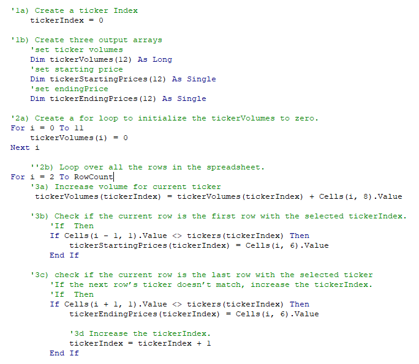
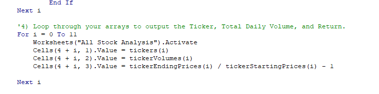

# Stock Analysis Refactored

##Overview
The client (Steve) wants a tool to analyze the entire stock market over multiple years. The current tool that was provided to the client was designed to analyze 12 stocks over 2 years. While this will work, it will be cumbersome and slow to analyze large volumes of data. The prior code for the original tool was analyzed and refactored to allow a more efficient processing of the data in a more timely manner. 

##Results
### Refactoring
The loop and variant coding was refactored to set 4 different arrays defined by a variant. A ticker index was also created. This allows for quicker execution by simplifying the steps using variants and removing unnecessary code. 

### Outcome

